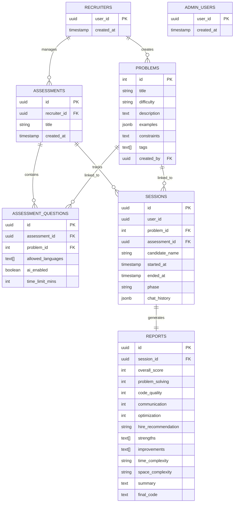

# LLD: Database Schema

This document details the relational database design for HackStorm AI, used for managing problems, assessments, interview sessions, and AI-generated reports.

## 1. Entity Relationship Diagram

## 2. Table Definitions

### 2.1 `problems`
Stores the DSA problem bank.
- **`examples`**: JSONB field containing input/output pairs.
- **`tags`**: Array of categories (e.g., "Hash Table", "Dynamic Programming").

### 2.2 `sessions`
Captures an individual interview attempt.
- **`chat_history`**: JSONB array of message objects `[{role: "user", content: "..."}, ...]`.
- **`phase`**: Tracks the current stage of the interview (INTRO, CODING, etc.).

### 2.3 `reports`
Detailed AI-generated feedback.
- **Scoring**: Integer values from 1-10 across 5 dimensions.
- **`hire_recommendation`**: Enum-like string (e.g., "Strong Hire", "No Hire").

### 2.4 `assessment_questions`
A join table between `assessments` and `problems` allowing recruiters to customize settings per question (like time limits).

## 3. Indexing Strategy

- **B-Tree Indexes**: Created on all Foreign Keys (`problem_id`, `session_id`, `recruiter_id`) to optimize join performance.
- **GIN Indexes**: Recommended for `problems.tags` and `sessions.chat_history` if searching within JSON/Array fields becomes a requirement.
