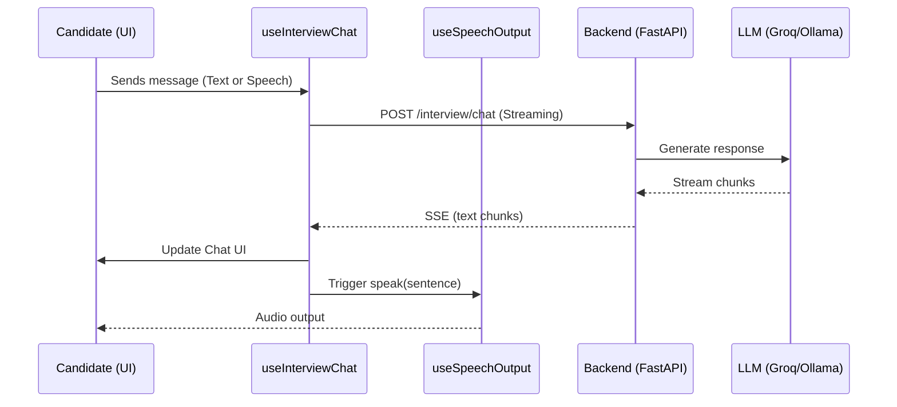

# LLD: Frontend Features

This document details the low-level design of the Next.js frontend, focusing on the feature-based architecture and state management for the AI Interview experience.

## 1. Feature-Based Architecture

The project follows a modular "Features" pattern located in `frontend/features/`. Each feature encapsulates its own hooks, services, and UI components.

### 1.1 Interview Feature
The core of the application, located in `features/interview/`.

#### Hooks
- `useInterviewSession`: Manages the overall lifecycle of an interview session (timer, phase tracking, finish logic).
- `useInterviewChat`: Handles real-time streaming communication with the backend.
- `useVoiceInput`: Manages speech-to-text using the Web Speech API or external services.
- `useSpeechOutput`: Manages text-to-speech using browser-native `speechSynthesis`.

## 2. Interview Interaction Flow

## 3. Real-time Streaming & TTS Synchronization

The `useInterviewChat` hook implements an intelligent buffering strategy for voice output:
1.  **Chunking**: As raw text chunks arrive via SSE, they are concatenated.
2.  **Sentence Detection**: The hook looks for punctuation marks (`.`, `!`, `?`) followed by a space.
3.  **Synchronized Speech**: Once a full sentence is detected, it is passed to the `speech.speak()` function immediately, while the next sentence continues to stream in the background. This ensures the AI starts talking before it has finished "thinking" the entire response.

## 4. State Management

- **Local State**: `useState` and `useRef` are used within hooks for ephemeral data (message history, buffer, loading states).
- **Global State**: Managed via Next.js Context or lightweight stores if needed for cross-feature communication (e.g., Auth state).

## 5. UI Components

- **CodeEditor**: Built on `@monaco-editor/react`. Updates to the code are debounced and sent as context with each chat message.
- **ChatPanel**: A responsive container for the message thread, using `framer-motion` for smooth entrance animations of AI responses.
- **VoiceController**: A visual indicator showing mic sensitivity and AI speaking status.
